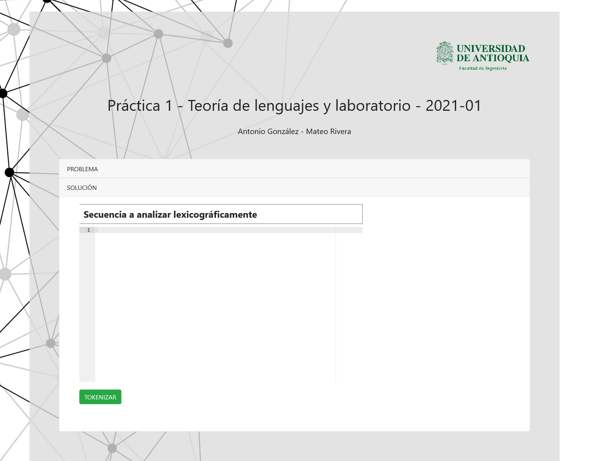

# Teoría de Lenguajes 2021-1

> Repositorio Curso de Teoria de Lenguajes UdeA 

[**Practica #1**](#practica-1)
| [**Practica #2**](#practica-1)

<br/>
<hr/>

## Practica #1
Un compilador se compone de diferentes elementos, y en las próximas 
prácticas se espera manejar dos módulos de gran importancia en el proceso 
de compilación, el primero de estos corresponde a un Analizador léxico, el 
cual mediante expresiones regulares y autómatas finitos convierte el código 
escrito en una lista ligada o array de tokens,estos tokens se componen de 
la siguiente manera, cada uno de ellos posee un atributo que identifica el 
tipo del token, y el Lexema o valor del token.

[Live Demo analizador-lexico-udea.herokuapp.com/](http://analizador-lexico-udea.herokuapp.com/)

### Prerequisitos

- npm
`npm install npm@latest -g`
- Python 3.9


### Instalacion

1. Clonar el repositorio  
   ```sh
   git clone https://github.com/antorpo/teoria_lenguajes_2021-1.git
   ```
   
2. Ir al directorio de la practica #1
   ```sh
   cd practica_01
   ```
   
3. Instalar dependencias del back-end
   ```sh
   pip install -r requirements.txt
   ```
   
4. Migrar la Base de Datos
   ```PY
   python manage.py migrate
   ```
   
5. Ir al directorio del front-end
   ```sh
   cd frontend
   ```
   
6. Instalar dependencias del front-end
   ```sh
   npm install
   ```
   
7. Compilamos la app para producción
   ```sh
   npm run build
   ```
   
8. Volvemos al directorio de la practica #1 y corremos el servidor de desarrollo
   ```sh
   cd .. && python manage.py runserver
   ```
   
9. Abrimos el aplicativo en el navegador con ruta `localhost:8000/`

<br/>

### Resultado



<br/>
<hr/>
